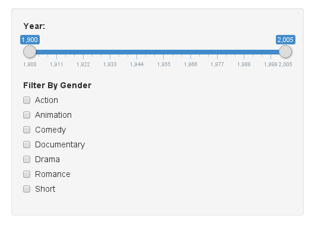

A very simple shiny application
========================================================
author: Raphael Cóbe
date: 22/12/2015

Goals
========================================================

- This is a **very** simple exercise to demonstrate the use o **shiny** to create data science applications.
- The internet movie database, http://imdb.com/, is a website devoted to collecting movie data supplied by studios and fans.
- It claims to be the biggest movie database on the web and is run by amazon.
- Data collection process, http://imdb.com/help/show_leaf?infosource.
- Updated data: http://www.imdb.com/interfaces
- Live demo:
    - https://raphaelmcobe.shinyapps.io/DataProduct

User input
========================================================

- Parameters Input:
    - A Slide bar to select the time frame for the analysis;
    - A set of checkboxes for selecting the Movie Genre or combination of Genres;
        - A movie can belong to more than one genre;



Output: Plot 1 - Number of Movies over the years
========================================================

As response, a plot with the distribution of movies over the years is generated


```r
imdb <- filterByGender(NULL,imdb)
selectedDataset <- aggregate(imdb$Count, by = list(year = imdb$year), FUN = sum)
filteredData <- filter(selectedDataset, year > minDate & year < maxDate)
plot <- nPlot(x ~ year, data = filteredData, type = "multiBarChart")
```

Output: Plot 1 (Result)
========================================================


```r
plot$show('inline', include_assets = TRUE, cdn = TRUE)
```

<link rel='stylesheet' href=//cdnjs.cloudflare.com/ajax/libs/nvd3/1.1.15-beta/nv.d3.min.css>
<script type='text/javascript' src=//ajax.googleapis.com/ajax/libs/jquery/1.8.2/jquery.min.js></script>
<script type='text/javascript' src=//d3js.org/d3.v3.min.js></script>
<script type='text/javascript' src=//cdnjs.cloudflare.com/ajax/libs/nvd3/1.1.15-beta/nv.d3.min.js></script>
<script type='text/javascript' src=//nvd3.org/assets/lib/fisheye.js></script> 
 <style>
  .rChart {
    display: block;
    margin-left: auto; 
    margin-right: auto;
    width: 800px;
    height: 400px;
  }  
  </style>
<div id = 'chart78d17c698e1d' class = 'rChart nvd3'></div>
<script type='text/javascript'>
 $(document).ready(function(){
      drawchart78d17c698e1d()
    });
    function drawchart78d17c698e1d(){  
      var opts = {
 "dom": "chart78d17c698e1d",
"width":    800,
"height":    400,
"x": "year",
"y": "x",
"type": "multiBarChart",
"id": "chart78d17c698e1d" 
},
        data = [
 {
 "year": 1951,
"x":            518 
},
{
 "year": 1952,
"x":            513 
},
{
 "year": 1953,
"x":            539 
},
{
 "year": 1954,
"x":            501 
},
{
 "year": 1955,
"x":            522 
},
{
 "year": 1956,
"x":            497 
},
{
 "year": 1957,
"x":            556 
},
{
 "year": 1958,
"x":            528 
},
{
 "year": 1959,
"x":            495 
},
{
 "year": 1960,
"x":            478 
},
{
 "year": 1961,
"x":            466 
},
{
 "year": 1962,
"x":            513 
},
{
 "year": 1963,
"x":            503 
},
{
 "year": 1964,
"x":            517 
},
{
 "year": 1965,
"x":            530 
},
{
 "year": 1966,
"x":            579 
},
{
 "year": 1967,
"x":            594 
},
{
 "year": 1968,
"x":            651 
},
{
 "year": 1969,
"x":            625 
},
{
 "year": 1970,
"x":            586 
},
{
 "year": 1971,
"x":            646 
},
{
 "year": 1972,
"x":            637 
},
{
 "year": 1973,
"x":            634 
},
{
 "year": 1974,
"x":            625 
},
{
 "year": 1975,
"x":            619 
},
{
 "year": 1976,
"x":            665 
},
{
 "year": 1977,
"x":            617 
},
{
 "year": 1978,
"x":            609 
},
{
 "year": 1979,
"x":            632 
},
{
 "year": 1980,
"x":            681 
},
{
 "year": 1981,
"x":            661 
},
{
 "year": 1982,
"x":            689 
},
{
 "year": 1983,
"x":            698 
},
{
 "year": 1984,
"x":            749 
},
{
 "year": 1985,
"x":            792 
},
{
 "year": 1986,
"x":            792 
},
{
 "year": 1987,
"x":            957 
},
{
 "year": 1988,
"x":            944 
},
{
 "year": 1989,
"x":            944 
},
{
 "year": 1990,
"x":            899 
},
{
 "year": 1991,
"x":            888 
},
{
 "year": 1992,
"x":            948 
},
{
 "year": 1993,
"x":           1016 
},
{
 "year": 1994,
"x":           1199 
},
{
 "year": 1995,
"x":           1248 
},
{
 "year": 1996,
"x":           1390 
},
{
 "year": 1997,
"x":           1568 
},
{
 "year": 1998,
"x":           1705 
},
{
 "year": 1999,
"x":           1927 
} 
]
  
      if(!(opts.type==="pieChart" || opts.type==="sparklinePlus" || opts.type==="bulletChart")) {
        var data = d3.nest()
          .key(function(d){
            //return opts.group === undefined ? 'main' : d[opts.group]
            //instead of main would think a better default is opts.x
            return opts.group === undefined ? opts.y : d[opts.group];
          })
          .entries(data);
      }
      
      if (opts.disabled != undefined){
        data.map(function(d, i){
          d.disabled = opts.disabled[i]
        })
      }
      
      nv.addGraph(function() {
        var chart = nv.models[opts.type]()
          .width(opts.width)
          .height(opts.height)
          
        if (opts.type != "bulletChart"){
          chart
            .x(function(d) { return d[opts.x] })
            .y(function(d) { return d[opts.y] })
        }
          
         
        
          
        

        
        
        
      
       d3.select("#" + opts.id)
        .append('svg')
        .datum(data)
        .transition().duration(500)
        .call(chart);

       nv.utils.windowResize(chart.update);
       return chart;
      });
    };
</script>


Output: Plot 2 - Comparison Between Budget and Ratings (averaged)
=================================================================

The third tab show a chart that compares the growth on budget compared with the average movies rating:


```r
h <- Highcharts$new()
h$xAxis(categories = filteredData$year, tickInterval=5, width=480)
h$yAxis(list(list(title = list(text = 'Budget'))
             , list(title = list(text = 'Ratings'), opposite = TRUE))
)
h$series(name = 'Budget', type = 'spline', data = filteredData$x)
h$series(name = 'Ratings', type = 'spline', data = filteredData$rating,
         yAxis = 1)
```

Output: Plot 2 - Result
=================================================================


```r
h$show('inline', cdn = TRUE, include_assets = TRUE)
```

<script type='text/javascript' src=//code.jquery.com/jquery-1.9.1.min.js></script>
<script type='text/javascript' src=//code.highcharts.com/highcharts.js></script>
<script type='text/javascript' src=//code.highcharts.com/highcharts-more.js></script>
<script type='text/javascript' src=//code.highcharts.com/modules/exporting.js></script> 
 <style>
  .rChart {
    display: block;
    margin-left: auto; 
    margin-right: auto;
    width: 800px;
    height: 400px;
  }  
  </style>
<div id = 'chart78d166e01fbc' class = 'rChart highcharts'></div>
<script type='text/javascript'>
    (function($){
        $(function () {
            var chart = new Highcharts.Chart({
 "dom": "chart78d166e01fbc",
"width":            800,
"height":            400,
"credits": {
 "href": null,
"text": null 
},
"exporting": {
 "enabled": false 
},
"title": {
 "text": null 
},
"yAxis": [
 {
 "title": {
 "text": "Budget" 
} 
},
{
 "title": {
 "text": "Ratings" 
},
"opposite": true 
} 
],
"xAxis": [
 {
 "categories": [ 1951, 1952, 1953, 1954, 1955, 1956, 1957, 1958, 1959, 1960, 1961, 1962, 1963, 1964, 1965, 1966, 1967, 1968, 1969, 1970, 1971, 1972, 1973, 1974, 1975, 1976, 1977, 1978, 1979, 1980, 1981, 1982, 1983, 1984, 1985, 1986, 1987, 1988, 1989, 1990, 1991, 1992, 1993, 1994, 1995, 1996, 1997, 1998, 1999 ],
"tickInterval":              5,
"width":            480 
} 
],
"series": [
 {
 "name": "Budget",
"type": "spline",
"data": [
 1643665.434783,
  1580612.5625,
1118004.444444,
    1919368.32,
2188717.333333,
 2345370.37037,
1109661.162162,
1107511.833333,
2191115.448276,
  2109681.0625,
1998157.692308,
       2846090,
3284805.606061,
2646555.555556,
3226233.333333,
3319257.142857,
3390042.857143,
5411388.888889,
4544078.787879,
4267676.577778,
2348279.828571,
1824314.205128,
 2592818.21875,
3109473.684211,
3103259.259259,
       4280375,
5091341.463415,
6904245.714286,
8635088.235294,
10798266.66667,
9082259.259259,
9325595.238095,
8844755.102041,
 11441510.6383,
10333112.67606,
9286785.967742,
       9713225,
10204256.75676,
11438180.32787,
17962288.13559,
15778753.96825,
17339713.63636,
14413278.40909,
17994802.08333,
23415407.57576,
22039661.77987,
23978515.54404,
21862434.95575,
22207973.57724 
] 
},
{
 "name": "Ratings",
"type": "spline",
"data": [
  6.24305019305,
6.293567251462,
6.133209647495,
 6.00878243513,
6.206704980843,
5.980482897384,
5.898201438849,
5.901515151515,
6.090505050505,
6.080543933054,
5.910515021459,
5.945614035088,
6.033598409543,
5.940232108317,
5.863962264151,
 5.94127806563,
5.845791245791,
5.715360983103,
       5.64144,
5.689249146758,
5.665170278638,
5.588697017268,
5.640694006309,
       5.69504,
5.629079159935,
5.586917293233,
5.732576985413,
5.598850574713,
5.545727848101,
5.624816446402,
5.680635400908,
5.773294629898,
5.667191977077,
5.734579439252,
 5.66452020202,
 5.57196969697,
5.552351097179,
5.500423728814,
5.540466101695,
5.435150166852,
5.749099099099,
5.646202531646,
5.593208661417,
5.492076730609,
5.739423076923,
5.747122302158,
5.393558673469,
5.858181818182,
5.637104307213 
],
"yAxis":              1 
} 
],
"id": "chart78d166e01fbc",
"chart": {
 "renderTo": "chart78d166e01fbc" 
} 
});
        });
    })(jQuery);
</script>


Conclusion
================================================================

- Developing data Products with shiny os quick;
- Making presentations using RStudio Presentation tool is also quick;
- Both interfaces look nice and can be used from a simple browser;
- The publishing tools are also easy to use;


